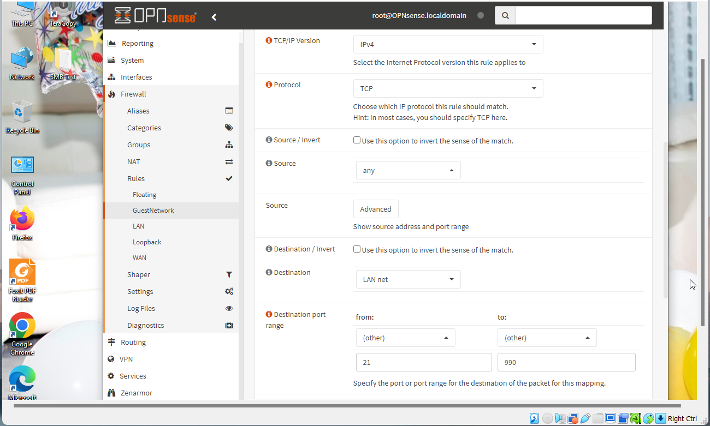

# Configuring FTP Server in Multi-LAN Lab

In this project, I embarked on configuring an FTP server within a
multi-LAN environment, responding to the request of an employer. The
task involved using OPNsense and leveraging tools like FileZilla FTP
Server and Client. The goal was to establish a functional FTP server
allowing users in the Guest network to access resources from the main
LAN securely. The project required not only technical prowess in
configuring firewall rules but also a nuanced understanding of
user-specific access controls and secure file transfers.

The following documentation outlines each step undertaken, accompanied
by relevant screenshots for clarity and ease of replication. Hence, I
meticulously documented each step with accompanying screenshots to
provide a comprehensive guide for effective understanding and
replication.

**REQUIREMENTS**

- Filezilla FTP server found:
  <https://filezilla-project.org/download.php?type=server>

- Filezilla FTP client found:
  <https://filezilla-project.org/download.php?platform=win64>

- 2 windows 10 client PC

- OPNsense Firewall configured with 2 LAN interfaces.

**Description of each steps:**

1.  **Install and configure FTP Server on PC1:**

    - I initiated the installation of the FileZilla FTP Server on PC1,
      ensuring it was properly configured to serve as the central point
      for FTP communication.

**Figure 1: The Screenshot showing the GUI of FileZilla Server after
Installation**

2.  **Create Firewall inbound rules to allow ports for (21,990):**

    - Navigating to the OPNsense firewall settings, I established
      inbound rules that explicitly permitted traffic on ports 21 (FTP)
      and 990 (FTP over TLS).

**Figure 2: Creating Firewall inbound rules with the matching TCP IP
Protocol highlighting the specific rules added for ports 21 and 990.**

3.  **Create Firewall inbound rules to allow passive port ranges:**

    - I extended the firewall configuration to include rules
      accommodating passive port ranges essential for FTP data transfer.

4.  **Configure a network share called 'Staff':**

    - On PC1, I created a network share named 'Staff' to serve as the
      centralized repository for FTP resources.

5.  **Create 3 subfolders ('Karen', 'Mark', 'Jin'):**

    - Within the 'Staff' share, I meticulously crafted subfolders for
      each user ('Karen', 'Mark', 'Jin'), ensuring a structured
      organization.

> 
>
> **Figure 3. Successfully established connection with the Server on PC1
> and retrieved the directory of the user, Karen.**

6.  **Create a text file in each folder titled with the user's name:**

    - I populated each user subfolder with a text file labeled with the
      respective user's name, contributing to a personalized user space.

7.  **Create 3 user accounts on the FTP Server:**

    - I configured three distinct user accounts on the FileZilla FTP
      Server, tailoring permissions to align with security and access
      requirements.

> 

**Figure 4. Configuring the FileZilla Server on PC1 and Adding 3 Users
Accounts on the Server with their assigned permissions**

8.  **Log into PC2, install, and configure the FTP client:**

    - On PC2, I installed the FileZilla FTP client and meticulously
      configured its settings to establish a connection with the FTP
      server.

9.  **Using the FTP client connect to the FTP server using the 'Karen'
    account:**

    - I successfully established a connection to the FTP server using
      the 'Karen' account through the FileZilla client, ensuring
      seamless access.

10. **Transfer the karen.txt file from the server to PC2:**

    - Executing a file transfer, I moved the 'karen.txt' file from the
      'Karen' folder on the server to PC2 using the FileZilla client.

> 
>
> **Figure 5. An Example showing the transferring of karen.txt file from
> the server to PC2**

11. **Log out of the user account 'Karen':**

    - I disconnected from the 'Karen' account on the FTP server,
      ensuring a secure logout after the file transfer.

12. **Log into the account 'Jin' upload the karen.txt file to the FTP
    server:**

    - Logging into the 'Jin' account on the FTP server, I uploaded the
      'karen.txt' file, demonstrating user-specific interactions.

**Figure
6. Log into the account “Jin” and uploaded the karen.txt file to the FTP
server**

Additionally, the following screenshots illustrates some of the main
procedures involved in configuring the FTP server within a multi-LAN
environment:

**Figure 7. The FTP traffic using encryption through FTPS (FTP over
TLS)**

**Figure 8. Transferring the karen.txt file from the server to PC2**

**Figure 9. Successfully established connection with the Server on PC1**

**Figure 10. Creating Firewall inbound rules to allow ports from 21
(default for explicit FTPS) to Port 990 (default for implicit FTPS)**

**Concluding Remark:**

In this lab, I successfully configured and managed an FTP server in a
multi-LAN environment. Through tasks such as installing and configuring
the FTP server, creating firewall rules, establishing network shares and
user accounts, and conducting file transfers, I gained hands-on
experience in setting up secure and efficient file sharing within the
network. The lab showcased my ability to deploy and manage essential
network services in a practical environment, contributing to my skills
in network administration and security.
